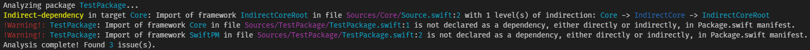
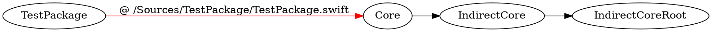
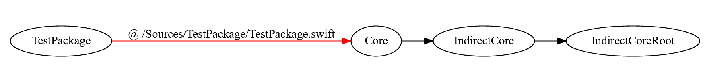

# TargetDependencyChecker

A simple command-line tool for analysing (local) dependencies between targets defined in Swift Package Manager projects, as well as catch any non-dependency import errors that can arise in larger target graphs.

Requirements:
----

Swift 5.5

Usage:
----

Clone the repository and build with `swift build`, and then use `swift run TargetDependencyChecker <options>`:

```shell
$ swift run TargetDependencyChecker check --help

OVERVIEW: 
Inspects a Swift Package Manager project and produce warnings about targets that include other targets that are not declared as dependencies in the Package.swift manifest.

USAGE: TargetDependencyChecker check [--package-path <package-path>] [--output-type <output-type>] [--warn-once-per-framework] [--warn-indirect-dependencies] [--no-color] [--print-full-paths] [--ignore-includes <ignore-includes>]

OPTIONS:
  -p, --package-path <package-path>
                          Specifies the path for the directory containing a Package.swift manifest for a Swift Package Manager project.
                          If not specified, defaults to the current working directory.
  -t, --output-type <output-type>
                          Specifies the format of the output.
                          Defaults to 'terminal' if not provided.

                              terminal
                                  Prints output of conversion in a format proper for terminal's standard output.
                              
                              xcode
                                  Prints output with leading file/line numbers as warnings that Xcode can detect when used as a build phase.

  -o, --warn-once-per-framework
                          When specified, omits warnings of violations for frameworks that where already reported in previous files in the same target.
  -i, --warn-indirect-dependencies
                          When specified, warns when importing a target that is not a direct dependency into another target.
  -c, --no-color          When specified along with --output-type terminal, produces a non-colorized output in stdout.
  -f, --print-full-paths  When specified along with --output-type terminal, prints the full path of each file in the diagnostics.
  --ignore-includes <ignore-includes>
                          Ignores all includes in the string separated by commas provided to this argument.
  -h, --help              Show help information.
```

Sample
---

There's a small test package included that can be used to test the program:

```shell
$ swift run TargetDependencyChecker check -iop ./TestPackage/
```

Will output:



Note that some of the arguments to `TargetDependencyChecker` can overlap with arguments recognized by `swift run`, in this case you can find the path of the built binary using `swift build --show-bin-path` and execute `TargetDependencyChecker` from there directly.

## GraphViz generation

[Graphviz](https://graphviz.org) files containing the dependency tree of a package can be generated using `TargetDependencyChecker graph`:

```shell
$ swift run TargetDependencyChecker graph --help

OVERVIEW: 
Produces a GraphViz .dot file describing the internal dependency graph of a Swift Package Manager project.

USAGE: TargetDependencyChecker graph [--package-path <package-path>] [--output <output>] [--include-indirect] [--include-tests] [--include-folder-hierarchy]

OPTIONS:
  -p, --package-path <package-path>
                          Specifies the path for the directory containing a Package.swift manifest for a Swift Package Manager project.
                          If not specified, defaults to the current working directory.
  -o, --output <output>   A .dot file to write the results to, relative to the current working directory. If not provided, prints the result to stdout, instead.
  -i, --include-indirect  Include indirect dependencies via `import` statements on target's files.
  -t, --include-tests     Include test targets in the graph.
  -f, --include-folder-hierarchy
                          Include information about the target's folder hierarchy as clusters in the graph.
  -h, --help              Show help information.
```

You can also use the sample project to generate a demo graph file:

```shell
$ swift run TargetDependencyChecker graph -p ./TestPackage/
```

Will produce:




